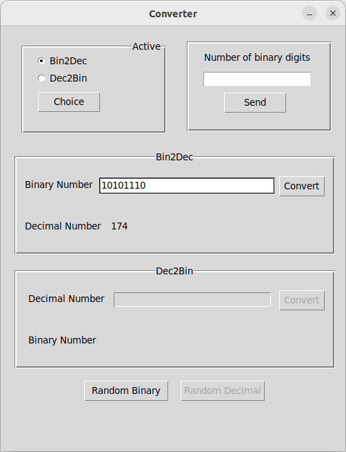

## Bin2Dec Converter       

The [binary numeral system](https://simple.wikipedia.org/wiki/Binary_number) is a way to write numbers using only two digits: 0 and 1.       
These are used in computers as a series of "off" and "on" switches.     

Small converter project Binary to Decimal develop in Python + Tkinter      

Idea from this [github](https://github.com/florinpop17/app-ideas/blob/master/Projects/1-Beginner/Bin2Dec-App.md) page


#### Prerequisites
You will need the following software to run the Bin2Dec Converter:
 - [Python 3](https://www.python.org/downloads/)


#### Installation
To get started with the **Bin2Dec Converter**, follow these steps:

1. **Clone** the repository:

```sh
git clone https://github.com/resole79/binary_to_decimal.git
```

2. **Run** the **main.py** file:

```sh
python main.py
```

#### File Structure   
 - **main.py**: Main program.
 - **display.py**: Class MyWindow       
 	- Method: converter_swap, check_number, binary_to_decimal, is_binary, decimal_to_binary, get_random_binary, get_random_decimal
 - **function.py**: some util function for my project


#### **Usage**

- Enter up to 8 binary digits in "Binary Number" input field and click the button "Convert"




## **Credit**

Author : Emilio Reforgiato (resole79)

##
<p align="right"><a href="https://www.linkedin.com/in/emilio-reforgiato/" target=”_blank” ></a></p>

